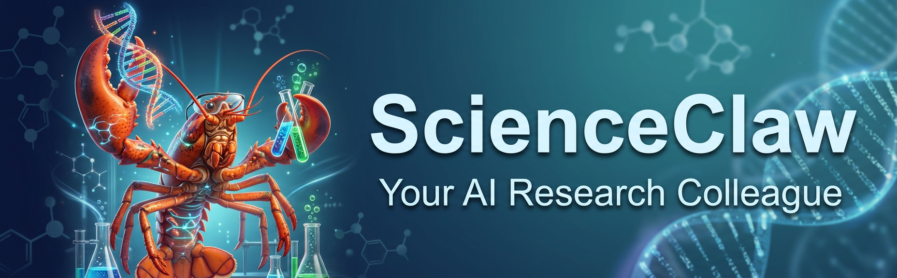
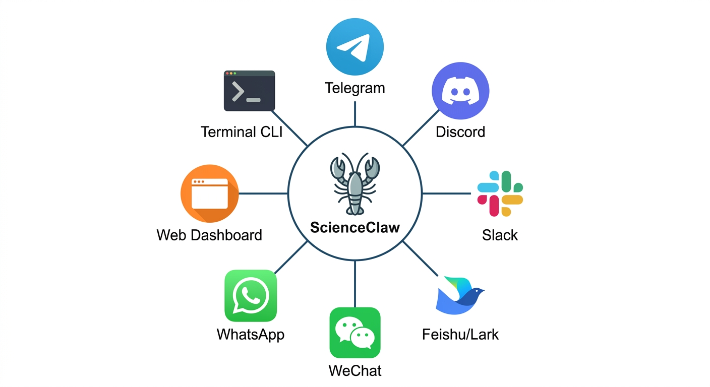
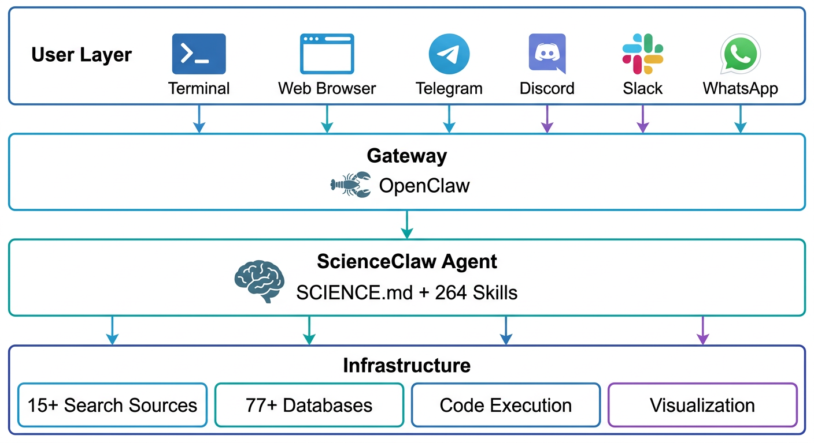
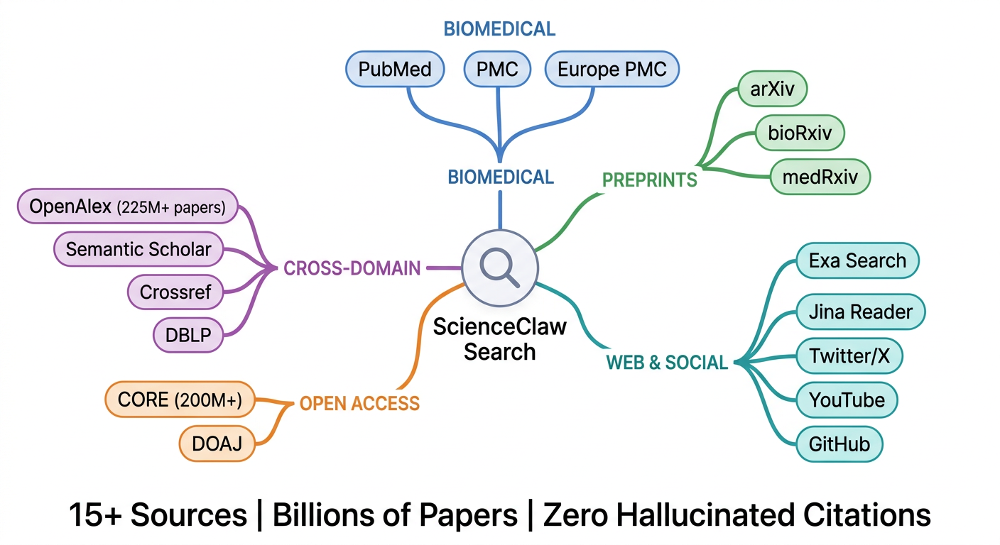
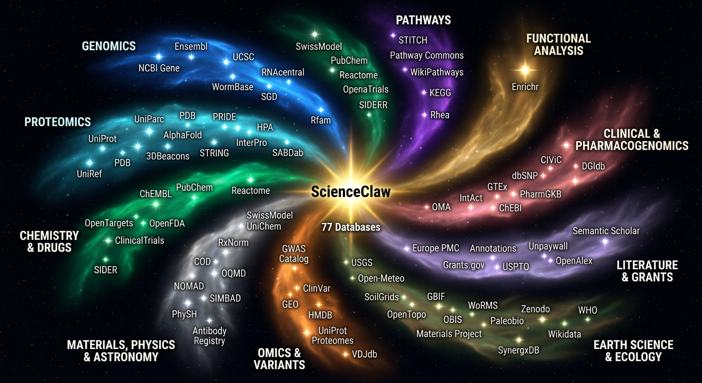
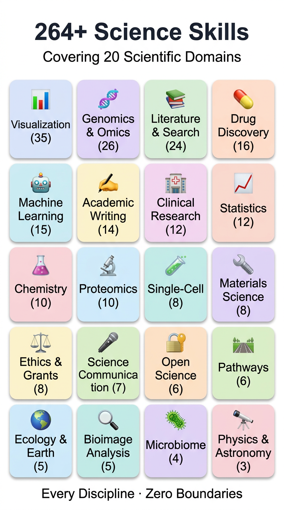
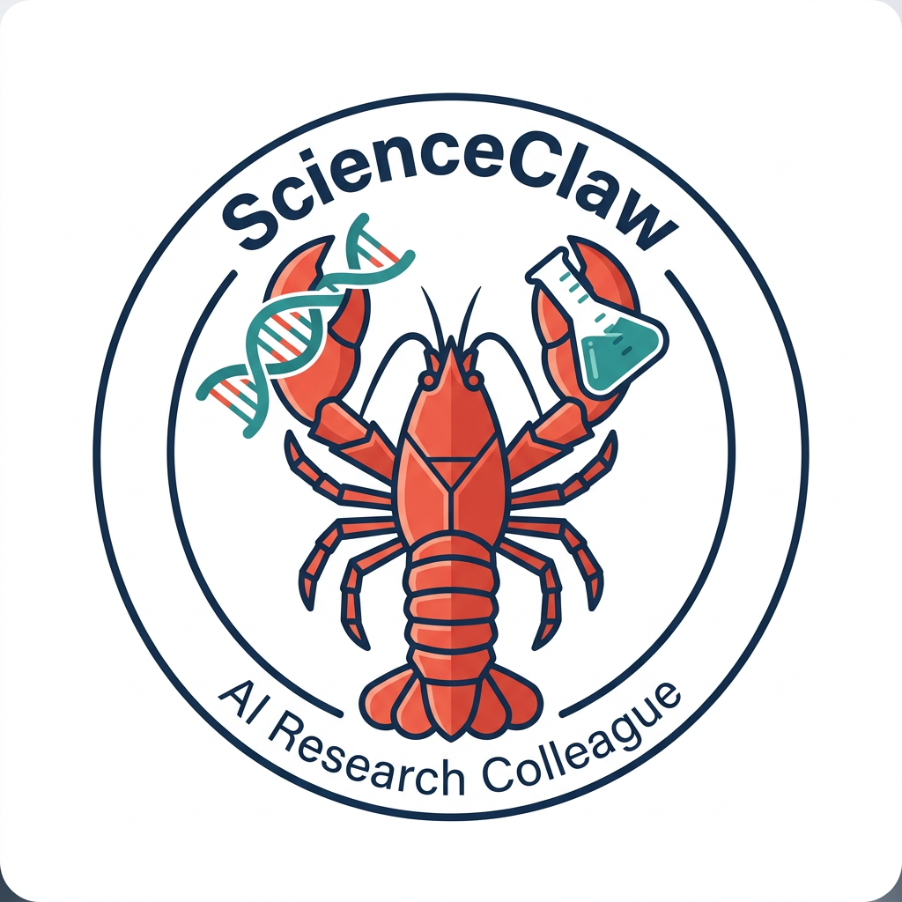

<div align="center">



<br />

# ScienceClaw

**Your AI Research Colleague**

[](LICENSE)
[](#-skills)
[](#-database-access)
[](#-deep-research)
[](https://nodejs.org/)

**EN** | [中文](docs/i18n/README_ZH.md) | [日本語](docs/i18n/README_JA.md) | [한국어](docs/i18n/README_KO.md)

</div>

---

ScienceClaw is a science research agent. It searches literature, queries databases, runs analyses, generates figures, and writes reports. Zero custom code — built entirely on [OpenClaw](https://github.com/openclaw/openclaw) with one markdown file (`SCIENCE.md`, ~200 lines) and 264 domain skills. The model does 99% of the work; the markdown teaches it how to be a scientist.

---

## See It In Action

### Case 1 — Investigate the role and significance of THBS2 in tumors

> **Prompt:** *"Investigate the role and significance of THBS2 in tumors"*

ScienceClaw autonomously searched PubMed, queried TCGA via cBioPortal and TIMER2.0, ran survival analyses in R, and compiled a 30-page report with 87 citations.

**Key findings:**

- THBS2 is significantly upregulated in **17 out of 33 TCGA cancer types**
- Combined THBS2 + CA19-9 panel achieved diagnostic AUC of **0.96** in a retrospective pancreatic cancer cohort — but dropped to **0.69** in a prospective validation set
- Tumor microenvironment analysis revealed THBS2 correlation with M2 macrophage infiltration across multiple cancer types

[Read the full case study &rarr;](docs/cases/case-thbs2-tumor.md)

---

### Case 2 — Survey the applications of LLM in biomedicine

> **Prompt:** *"Survey the applications of LLM in biomedicine"*

ScienceClaw conducted a systematic literature search across PubMed, Semantic Scholar, and OpenAlex, then synthesized findings into a structured survey with trend analysis and visualizations.

**Key findings:**

- Medical LLM publications grew **570x in two years** — from 8 in 2022 to 4,562 in 2024
- Med-PaLM 2 reached **86.5%** accuracy on USMLE, surpassing the expert physician threshold
- The healthcare LLM market is projected to reach **$110B by 2030**

[Read the full case study &rarr;](docs/cases/case-llm-biomedicine.md)

---

## Quick Start

### Prerequisites

<div align="center">

| Requirement | Version | Notes |
|-------------|---------|-------|
| Node.js | >= 22 | Required |
| Python | >= 3.10 | For code execution (R, Julia optional) |
| Docker | Latest | Optional — for containerized deployment |

</div>

### Step 1 — Clone and configure

```bash
git clone https://github.com/Zaoqu-Liu/ScienceClaw.git
cd ScienceClaw
cp .env.example .env        # add your API keys
```

### Step 2 — Install dependencies

```bash
bash scripts/setup.sh
```

### Step 3 — Run

```bash
scienceclaw run              # auto-starts gateway + opens TUI
```

That's it. One command.

For one-shot mode, skip the TUI entirely:

```bash
scienceclaw ask "Search TREM2 in Alzheimer's disease and summarize recent findings"
```

---

## What It Can Do

<div align="center">

| Capability | Details |
|------------|---------|
| **Search literature** | 15+ sources — PubMed, Semantic Scholar, OpenAlex, Europe PMC, and more |
| **Query databases** | 77+ databases — UniProt, PDB, NCBI, ChEMBL, STRING, GTEx, ClinicalTrials.gov, and more |
| **Run code** | Python, R, Julia via bash — install packages on the fly |
| **Generate figures** | Journal-spec palettes (NPG, Lancet, JCO, NEJM), publication-ready sizing |
| **Write reports** | Real citations from search results, never fabricated |
| **Review research** | 8-dimension ScholarEval rubric for systematic quality assessment |

</div>

---

## Channel Integrations

<div align="center">

</div>

<br />

ScienceClaw inherits all channel integrations from OpenClaw. Connect your preferred interface:

<div align="center">

| Channel | How to use |
|---------|-----------|
| **Terminal UI** | `scienceclaw tui` |
| **Web Dashboard** | `scienceclaw openclaw dashboard` |
| **Telegram** | [Setup guide](docs/channels/telegram.md) |
| **Discord** | [Setup guide](docs/channels/discord.md) |
| **Slack** | [Setup guide](docs/channels/slack.md) |
| **Feishu / Lark** | [Setup guide](docs/channels/feishu.md) |
| **WeChat** | [Setup guide](docs/channels/wechat.md) |
| **WhatsApp** | [Setup guide](docs/channels/whatsapp.md) |
| **Matrix** | [Setup guide](docs/channels/matrix.md) |
| + more | `scienceclaw openclaw channels --help` |

</div>

---

## Architecture

<div align="center">

</div>

<br />

```
ScienceClaw = OpenClaw + SCIENCE.md + 264 Skills
```

No TypeScript. No Python servers. No MCP. No plugins. The model does the work.

<div align="center">

| Layer | Components |
|-------|-----------|
| **User** | Terminal UI, Web Dashboard, Telegram, Discord, Slack, Feishu, WeChat, WhatsApp, Matrix |
| **Gateway** | OpenClaw gateway — routes messages, manages sessions, handles tool calls |
| **Agent** | Single `ScienceClaw` agent powered by `SCIENCE.md` (~200 lines) + 264 domain skills |
| **Infrastructure** | `web_search`, `web_fetch`, `bash` — the three built-in OpenClaw tools that do everything |

</div>

---

## 🔍 Deep Research

<div align="center">

</div>

<br />

ScienceClaw searches across 15+ sources, cross-references results, and verifies citations before including them in reports.

<div align="center">

| Category | Sources |
|----------|---------|
| **Biomedical literature** | PubMed, PubMed Central, Europe PMC |
| **Broad academic** | Semantic Scholar, OpenAlex, CrossRef, CORE |
| **Preprints** | bioRxiv, medRxiv, arXiv |
| **Clinical** | ClinicalTrials.gov, WHO ICTRP |
| **Patents & grants** | Google Patents, NIH RePORTER |
| **General** | Google Scholar, Web search |

</div>

---

## 🗄 Database Access

<div align="center">

</div>

<br />

77+ databases across 9 disciplines, all accessed through their public APIs via `web_fetch`.

<div align="center">

| Discipline | Databases | Count |
|------------|-----------|-------|
| **Genomics & Transcriptomics** | NCBI Gene, Ensembl, UCSC Genome Browser, GEO, TCGA, GTEx, ENCODE | 10+ |
| **Proteomics & Structure** | UniProt, PDB, AlphaFold DB, InterPro, Pfam, SWISS-MODEL | 8+ |
| **Pathways & Interactions** | STRING, BioGRID, KEGG, Reactome, WikiPathways, IntAct | 8+ |
| **Pharmacology & Drug Discovery** | ChEMBL, DrugBank, PubChem, PharmGKB, DGIdb, TTD | 8+ |
| **Disease & Phenotype** | OMIM, DisGeNET, ClinVar, GWAS Catalog, HPO, Orphanet | 8+ |
| **Immunology** | IEDB, IMGT, ImmPort, TIMER2.0, TCIA | 6+ |
| **Microbiome** | GMrepo, gutMDisorder, BugBase, MicrobiomeDB | 5+ |
| **Clinical & Epidemiology** | ClinicalTrials.gov, GBD, WHO GHO, SEER, cBioPortal | 7+ |
| **Model Organisms** | MGI, FlyBase, WormBase, ZFIN, RGD, SGD | 7+ |

</div>

---

## 📚 Skills

<div align="center">

</div>

<br />

264 domain skills provide detailed guidance for specific techniques. Each skill is a markdown file that teaches the model *how* to perform a particular analysis.

<div align="center">

| Domain | Example Skills |
|--------|---------------|
| **Bioinformatics** | Differential expression, gene set enrichment, pathway analysis, network construction |
| **Single-cell** | Clustering, trajectory inference, cell type annotation, RNA velocity |
| **Survival analysis** | Kaplan-Meier curves, Cox regression, forest plots, nomograms |
| **Visualization** | Volcano plots, heatmaps, Manhattan plots, Circos plots, UMAP/tSNE |
| **Drug discovery** | Target identification, molecular docking, ADMET prediction, drug repurposing |
| **Clinical** | Meta-analysis, diagnostic test evaluation, risk factor analysis, Mendelian randomization |
| **Genomics** | Variant annotation, GWAS analysis, copy number variation, mutation signatures |
| **Immunology** | Immune infiltration, neoantigen prediction, TCR/BCR repertoire analysis |
| **Machine learning** | Feature selection, model training, cross-validation, SHAP interpretation |

</div>

---

## Deployment

### Local (recommended for development)

Already covered in [Quick Start](#quick-start).

### Docker

```bash
docker-compose up
```

### Cloud

One-click deployment to your preferred platform:

<div align="center">

| Platform | Deploy |
|----------|--------|
| **Railway** | [](https://railway.com/template) |
| **Fly.io** | `fly launch` — see [docs/deploy/fly.md](docs/deploy/fly.md) |

</div>

---

## Contributing

Contributions are welcome. Please read [CONTRIBUTING.md](CONTRIBUTING.md) before submitting a pull request.

---

## Author

**LIU Zaoqu**

Institute of AI-Powered Medicine (IAPM), Guangdong Provincial People's Hospital · [pi-HuB](https://github.com/pi-HuB)

Contact: [liuzaoqu@163.com](mailto:liuzaoqu@163.com)

---

## License

This project is licensed under the [MIT License](LICENSE).

---

<div align="center">

<br />



<br />

**ScienceClaw** — Your AI Research Colleague.

</div>
